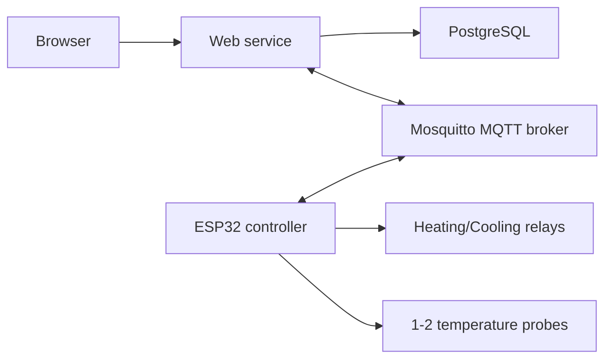

# Initial architecture

This is the first proposed architecture for the ESP32 controller and the
companion web service.

## Technology choices

Recommended first implementation choices:

- Firmware: PlatformIO + Arduino framework for ESP32
- Broker: Eclipse Mosquitto
- Web backend: FastAPI
- Web UI: server-rendered HTML templates + light JavaScript for charts/forms
- Database: TimescaleDB on PostgreSQL
- Local panel: external I2C OLED + 4 physical buttons

Reasoning:

- PlatformIO keeps firmware builds repeatable and supports ESP32 well.
- FastAPI is quick to build against and works cleanly in Docker.
- A server-rendered UI avoids introducing a second frontend build system too
  early.
- PostgreSQL is more than enough for low-rate telemetry history and config data.

## System overview



## Firmware responsibilities

The ESP32 firmware should be split into small modules with clear boundaries.

### `output_manager`

- expose logical outputs `heating` and `cooling`
- map each output to a configured driver
- enforce mutual exclusion between heating and cooling
- verify requested state versus observed state when supported

### `control_engine`

- thermostat state machine
- hysteresis handling
- heating/cooling delays
- relay interlock
- safety shutdown

### `profile_engine`

- active profile tracking
- step transitions
- ramp interpolation
- pause/resume
- power-loss recovery

### `sensor_manager`

- read DS18B20 probes
- apply calibration offsets
- detect invalid or stale readings

### `config_manager`

- manage two config domains:
- `system_config` stored locally in NVS
- `fermentation_config` received from MQTT and stored in NVS
- validate incoming config
- track active config versions

### `provisioning_manager`

- detect first boot or missing `system_config`
- start recovery AP when unprovisioned
- expose local setup page or API
- save validated `system_config` to NVS
- allow manual recovery mode on boot button hold
- optionally start recovery AP after prolonged Wi-Fi failure

### `local_ui`

- render OLED home and diagnostics screens
- handle four-button navigation
- manage display dim/off timers and wake behavior
- publish local override changes into device state
- remain fully optional so the controller can run headless

### `mqtt_client`

- connect/reconnect
- publish MQTT last will and periodic heartbeat
- publish telemetry/state
- subscribe to config and command topics
- publish availability and acknowledgements

### `ota_manager`

- check firmware manifest over HTTP/HTTPS
- download new firmware image over Wi-Fi
- validate version/channel before install
- perform OTA update and reboot
- report progress and result through state/event topics

### `state_persistence`

- save active mode, step, timestamps, and fault state
- restore after reboot

## Web service responsibilities

### `device registry`

- list known devices
- store metadata and last-seen timestamps

### `config UI`

- system settings for onboarding and installation records
- setpoint and hysteresis form
- profile editor
- run mode controls
- alarm settings

### `MQTT bridge`

- publish retained desired config
- subscribe to availability/heartbeat/state/telemetry/ack topics
- write telemetry to database

### `history views`

- live dashboard
- temperature graph
- relay activity graph
- active profile progress

## Docker deployment shape

Planned services:

- `mqtt`: Eclipse Mosquitto broker
- `web`: FastAPI application
- `db`: PostgreSQL database
- `firmware-files`: firmware manifest and binary hosting, either inside `web` or
  as static files behind a reverse proxy

Later optional services:

- `grafana`: if richer dashboards are needed
- `nginx`: if reverse proxy/TLS termination is needed

## Suggested repository layout

```text
brewesp/
  docs/
  firmware/
    include/
    src/
    test/
    platformio.ini
  services/
    web/
      app/
      tests/
      Dockerfile
      requirements.txt
  infra/
    mosquitto/
    compose.yaml
```

## ESP32-specific notes

The target device has 4 MB flash, which is sufficient for:

- firmware with MQTT and Wi-Fi
- OTA support if partitions are planned carefully
- persisted configuration and runtime state in NVS

It is not a good reason to host a large JavaScript app on the device itself.
That is another reason to keep the main UI in Docker and reserve ESP resources
for control, networking, and resilience.

## Data ownership

Use this split:

- ESP32 owns actual runtime state and safe relay behavior
- Web service owns UI workflows and long-term history
- MQTT is the integration bus, not the source of truth for physical safety

This matters because the ESP32 must keep operating safely even if:

- MQTT is down
- Wi-Fi disconnects
- the web service is offline
- the database is unavailable

## Provisioning model

The device should support three operating states.

### `normal`

- uses saved `system_config`
- joins configured Wi-Fi network
- connects to MQTT
- runs control logic normally

### `onboarding`

Entered when:

- no valid `system_config` exists
- the device is new or factory-reset

Behavior:

- start a recovery AP
- expose local onboarding page/API
- accept Wi-Fi, MQTT, display, and output-backend settings
- persist `system_config`
- reboot into `normal`

### `recovery`

Entered when:

- the user forces it during boot
- Wi-Fi connection fails for a configured amount of time

Behavior:

- keep controller safe locally
- expose recovery AP and local config page/API
- allow repair of network and bootstrap settings

Recommended AP behavior:

- SSID pattern: `brewesp-setup-<suffix>`
- default recovery IP: `192.168.4.1`
- recovery AP enabled by default

Recommended local setup fields:

- device id
- Wi-Fi SSID and password
- MQTT host, port, auth, topic prefix
- display driver and I2C address
- heating output backend
- cooling output backend
- Shelly connection details when applicable

Recommended manual recovery entry:

- hold the `Back` button during boot

## OTA update model

Recommended OTA flow:

1. Web service publishes firmware metadata and binary download URL.
2. ESP32 is notified via MQTT command or scheduled check.
3. ESP32 downloads firmware directly over HTTP/HTTPS.
4. ESP32 installs update into OTA partition, reboots, and reports result.

Why not distribute firmware over MQTT:

- firmware binaries are too large for MQTT to be the primary transport
- retries and resume behavior are worse
- HTTP/HTTPS hosting is easier to inspect and secure

Recommended control split:

- MQTT triggers `check_update` or `start_update`
- HTTP/HTTPS transfers the manifest and `.bin`
- state/event topics expose version, in-progress status, and errors

Suggested firmware manifest fields:

- `version`
- `channel`
- `published_at`
- `min_schema_version`
- `sha256`
- `download_url`

## Output backend model

The control engine should not know whether an output is a GPIO pin or a Wi-Fi
relay. It should call a common interface, for example:

- `set_heating(on/off)`
- `set_cooling(on/off)`
- `get_heating_state()`
- `get_cooling_state()`

Initial backend implementations:

1. `gpio`
   Direct pin control on the ESP32.
2. `shelly_http_rpc`
   Direct local-network control of Shelly Gen3 devices using their RPC/HTTP
   endpoint.
3. `kasa_local`
   Direct local-network control path for TP-Link Kasa devices such as `KP105`.
   This should be treated as experimental until validated against the exact
   device/firmware combination in use.

Reason for preferring local Shelly RPC over Shelly-via-MQTT on the first pass:

- it keeps the real-time control path local between ESP32 and relay
- heating/cooling can continue even if the MQTT broker is down
- it avoids coupling physical actuation to broker availability

This is an architectural recommendation based on Shelly's documented support for
HTTP RPC, MQTT, and `Switch.Set`.

## Configuration split

Use two separate config documents with different lifecycles.

### `system_config`

Rarely changed installation/configuration data:

- device id
- Wi-Fi credentials
- MQTT broker host, port, auth, TLS mode
- heartbeat intervals
- time zone
- whether local UI is enabled
- output backend type for heating/cooling
- GPIO pin mapping if `gpio` is used
- button mapping if local buttons are used
- display driver and display sleep settings if local display is used
- Shelly endpoint/auth/device mapping if `shelly_http_rpc` is used

This should be stored locally on the ESP32 in NVS and managed primarily through
a local onboarding/recovery API or captive portal. It should not depend on
MQTT to become reachable.

### `fermentation_config`

Frequently changed process data:

- thermostat setpoint
- hysteresis
- delays
- profile steps
- ramping
- alarm thresholds
- run mode and pause/resume state

This should be distributed over MQTT from the web service and cached locally in
NVS by the ESP32.
